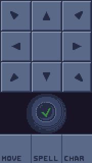
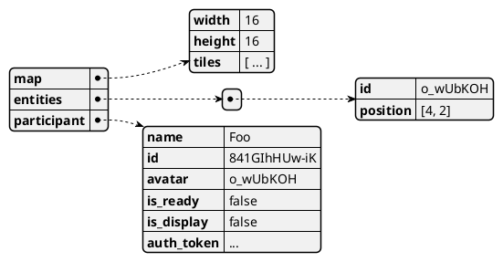

# Shared Space Design

As described in [#16].

## Overview

The goal of this epic is to have players move around in a shared space.

## Starting the game

Once all non-display participants are ready, the game session starts, and all
participants are redirected once the session is setup for playing.

Display participants are redirected to the Game view. Player participants are
redirected to the Control view.

---

Game setup currently includes generating and populating the game map. This
stage may include more steps as the game develops.

For this epic, a rectangular room will be generated for players to spawn in.

## Interactions

Participants submit their actions through the Control view.

They specify their action, and mark it as ready once they're prepared to
execute it.

Once all participants are ready, the moves are executed.

The only action in scope is movement.

## Rendering

The game's rendering system is based around game states - the system receives a
game state, and then makes the appropriate calls to three.js to display the
given state.

### Rendering the map

The map consists of tiles. Each tile can be either empty, floor, or wall. Each
tile can be represented by a textured cube at the appropriate position ( or
nothing in case of an empty tile ).

These can be merged into a single [BufferGeometry], using
[BufferGeometryUtils], to reduce the amount of draw calls needed. See three.js'
[Minecraft example].

Later on, this can be optimized to only generate visible faces.

The map is passed to the renderer at the start of the game. The generated
geometry can be used until a different map is passed to the renderer.

### Rendering entities

Entities are the dynamic actors that interact on the map. Entities are
represented as [Sprites].

Entities may appear and disappear between game states, e.g. an enemy dies, or a
companion is spawned. This means that the renderer must keep track of which
sprite belongs to which entity, and dynamically create / destroy / reuse
sprites.

### Animating between states

As the game progresses, the next game state arrives. Instead of simply
rendering the new state, the rendering system must animate the events that led
to this new game state.

The server keeps track of the events, and broadcasts them alongside the new
state. Each event is a piece of data that represents an action in the game.
Each event can be played as an animation.

For example, an event is `Entity#o_wUbKOH` moved from `[4, 2]` to `[5, 1]`. The
rendering system then plays a short animation where the entity moves to its new
position.

## Data structure

The map's `tiles` contains an array of all tiles, in row-major order. Each tile
is represented by a single number, e.g. 0 is empty, 1 is floor, 2 is wall, etc.

Participants now have an `avatar` property, that points to the entity that they
control. The only entities for now are player characters. Participants won't
always have an avatar, e.g. consider display participants.

[#16]: https://github.com/foxssake/dumber-dungeons/issues/16
[BufferGeometry]: https://threejs.org/docs/index.html#api/en/core/BufferGeometry
[BufferGeometryUtils]: https://threejs.org/docs/index.html#examples/en/utils/BufferGeometryUtils
[Minecraft example]: https://threejs.org/examples/#webgl_geometry_minecraft
[Sprites]: https://threejs.org/docs/index.html#api/en/objects/Sprite
