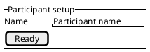
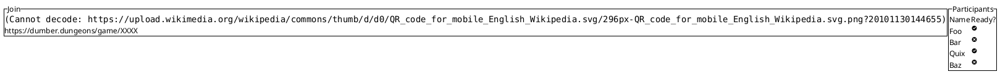
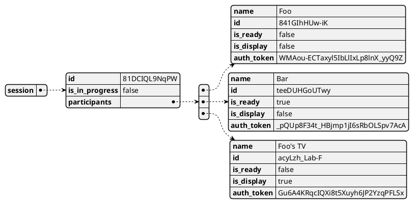

# Connection Sequence Design

As described in [#17].

## Overview

The feature can be broken down to the following major points:

1. Create a session
1. Participants join the session
1. Participant setup
1. Session start

## Session management

```puml

actor "Host Participant" as HP
boundary "Main Screen" as MS
entity "Server" as S

HP -> MS: Open in browser
MS -> S: Request game session
S -> MS: Respond with game session
MS -> HP: Redirect to session page
MS -> HP: Display instructions to join

```

When the host participant opens the game on their main screen, the application
creates a new game session and displays instructions on how to join.

---

Sessions are objects that have an ID and a list of participants that are
currently in the session.

Session IDs are randomly generated, to ensure all IDs are unique. This property
can be useful for scaling horizontally as well - instances can generate IDs for
a shared storage independently of each other.

Participants in this case represent the user *as part of the session*.
Participants do not exist outside of game sessions.

Participants also have a randomly generated ID, and in addition, a name and a
readiness flag.

For convenience, participants may have globally unique IDs, but they must
always belong to a game session.

### Displays

Aside from participants, displays may also connect to game sessions, e.g. the main
screen or TV the host is using. Displays don't interact with the game, they
just present its state to users.

Displays are participants themselves, marked with an `is_display` flag.

## Joining the session

When a participant opens the session - i.e. opens its link in a browser -, they
connect to the game through WebSocket. This will be used to send actions to the
server, and to receive state updates from it.

Initially, the server creates a Participant object, and sends its data to the
browser. The browser can then use this data to authenticate as the participant
itself.

On the server, the specified Session is validated ( i.e. does it exist? ), and
if so, a Participant is created and added to the list of players in the Session.
This event is broadcast to the Participants already in the session.

### Data storage

For starters, we can keep Session and Participant objects in memory, in a
simple dictionary and do lookups based on ID.

Later we can move on to keeping these objects in an actual database, so game
data is not tied to a single running instance, enabling horizontal scaling.

### WebSocket message routing

On the backend, [nest.js] has built-in support for WebSockets, through a
[socket.io] adapter - see [nest.js WS docs].

On the frontend, [socket.io] provides a high-level API similar to node's
EventEmitter.

## Participant setup

After successfully joining, participants are presented with the player setup
screen. For the scope of this epic, participants can edit their own names and
toggle their readiness.



During this phase, on the main screen, all Participants and their state is
displayed next to the join instructions. This is updated in real-time, as
participants join or update their settings.



Participant actions ( changing name or readiness ) are submitted through
WebSocket.

### Authentication

* WebSocket object
    * Participants can be associated with a specific WebSocket connection object
    * pros: Simple?
    * cons: Not scalable, Potentially hacky
* Authentication tokens
    * Aside from IDs, Participant objects also get an Auth token
    * This auth token is only handed out to the Participant actor during creation
    * The auth token can be used to perform actions on the Participant object
    * pros: Relatively simple, Scalable
    * cons: Extra network traffic

**Verdict:** Participants are associated with WebSocket connections. An initial
auth token is sent to the participant, but is not needed to be sent with every
message.

Authentication tokens are generated and set as http-only cookies on join. These
can be used on the server to determine if it's an existing participant
reconnecting to a game or a new one.

Note that reconnecting is out of scope for now, authentication tokens will be
useful later in development.

## Session start

During every readiness change, the server checks if all Participants are ready in
the affected session. If so, it broadcasts a session start event.

Clients lock the Participant settings and display a message that the session has
started.

## Data model



[#17]: https://github.com/foxssake/dumber-dungeons/issues/17
[nest.js]: https://nestjs.com/
[socket.io]: https://socket.io/
[nest.js WS docs]: https://docs.nestjs.com/websockets/gateways
